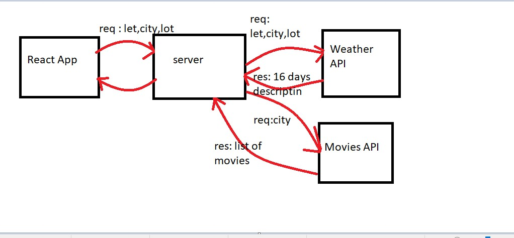

# City Explorer
## Request Response Cycle

**Author**: Amani AL-Zoubi
**Version**: 1.0.0

## Overview
City Explorer: a website that gives you once you write a city name, its location, future weather for the next16 days, and list of movies related for this city 
## Getting Started
you only need to write a city that you want it and have fun 

## Architecture
this app has been created using React.js

## Change Log

## Credit and Collaborations

 ## Time Estimates
1. Name of feature: 
    Errors (revisited).
    Estimate of time needed to complete: 1 hour

    Start time: 3:00 pm

    Finish time: 4:30 pm

    Actual time needed to complete:  hour and half

## class 08
## Request Response Cycle

 ## Time Estimates
1. Weather : 
    Estimate of time needed to complete: 1 hour

    Start time: 4:00 pm

    Finish time: 5:30 pm

    Actual time needed to complete:  hour and half

2. Movies :

    Estimate of time needed to complete: 1 hour

    Start time: 5:30 pm

    Finish time: 7:30 pm

    Actual time needed to complete:  hour 